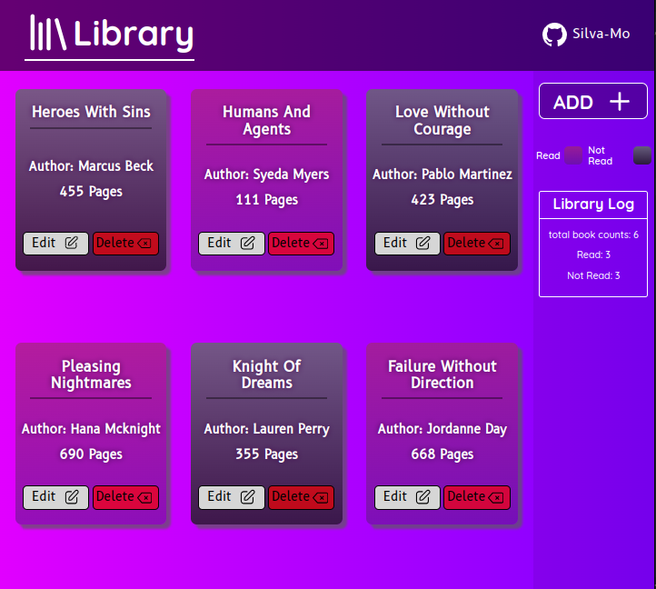

# Library
## Result

[LIVE DEMO](https://silva-mo.github.io/Library/)

## About
That is my first TOP JS project. It requires a good understanding of JS (Objects, Prototypes, and Object Constructors, Classes) and intermediate HTML/CSS concepts.

Alhamdulillah

## What was needed to complete it:
- Using JS objects and prototypes
- Good CSS skills (Flexbox and Grid)
- Good layout organization and planning

## Challenges that I've overcome: 
- making the page responsive for different screen sizes
- Organizing the layout so it looks nice for the users